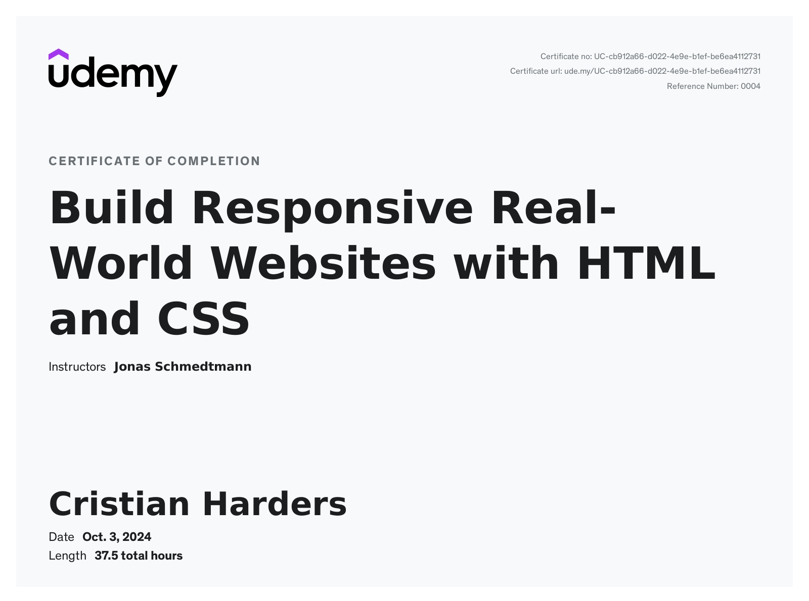
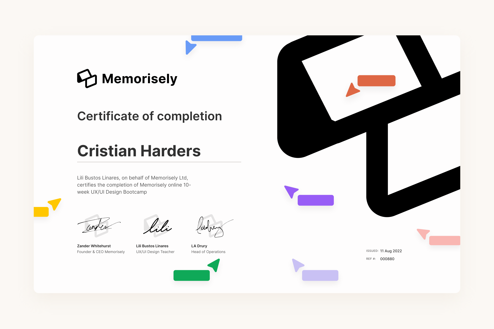

<h1 align="center" style="font-family: 'Inter', sans-serif;">
  Cristian Harders
</h1>

  

## 🚀 Sobre mí

📍 **Viviendo en Málaga, España**  
🎓 **Estudiante de Desarrollo de Aplicaciones Web en la Universidad Europea de Madrid**  
💻 **Apasionado por la creatividad del front-end y la lógica del back-end**  
🎨 **Amante del UX/UI - diseño para todos, creando experiencias accesibles y efectivas**  
🚀 **Siempre curioso y aprendiendo las últimas tendencias tecnológicas**  
🗣️ **Bilingüe: Inglés nativo y español nativo**

## 👾 Lenguajes/Frameworks

## 🛠️ IDEs/HERRAMIENTAS/VERSION CONTROL

  
  
  
  
  
  
  
  

## 🎓 Formación

- 📚 **TS Desarrollo de Aplicaciones Web** - Universidad Europea de Madrid (2023 - actualidad)  
  - 🏆 Notas destacadas en Programación y Lenguajes de Marcas
- 🎨 **Bootcamp de Diseño UX/UI** - Memorisely (2021)

## 📜 Certificados

- **Build Responsive Real-World Websites with HTML and CSS**  
  _Instructor: Jonas Schmedtmann_  
  _Emitido por: Udemy_  
  

- **UX/UI Design Bootcamp**  
  _Instructor: Lilian Bustos Linares_  
  _Emitido por: Memorisely_    
  

## 🌟 Aspectos Destacados

- 🌐 **Experiencia en proyectos reales** durante el bootcamp de UX/UI
- 🌍 **Experiencia internacional**: Estudios y trabajo en Reino Unido

## 📫 ¡Conectemos!

  
  

---

  💡 **Entusiasta por aprender** y contribuir en proyectos web innovadores. ¡Creemos algo increíble juntos!

